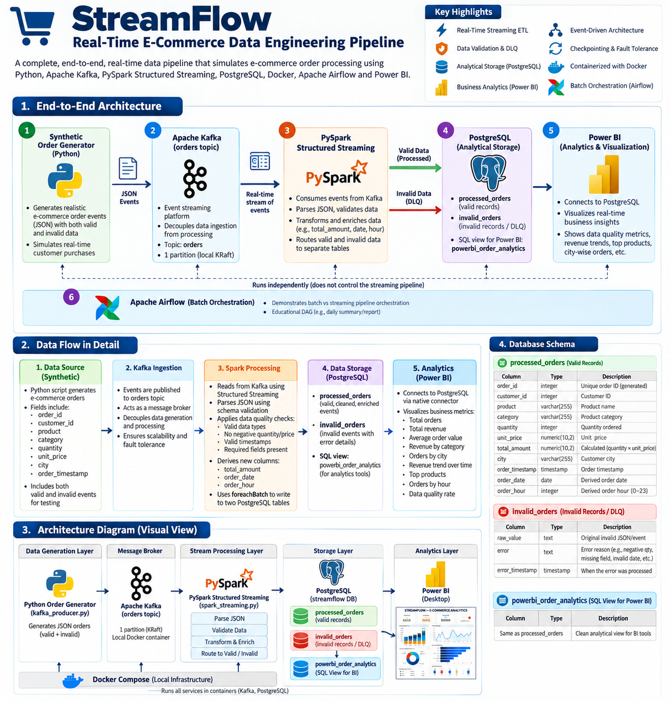
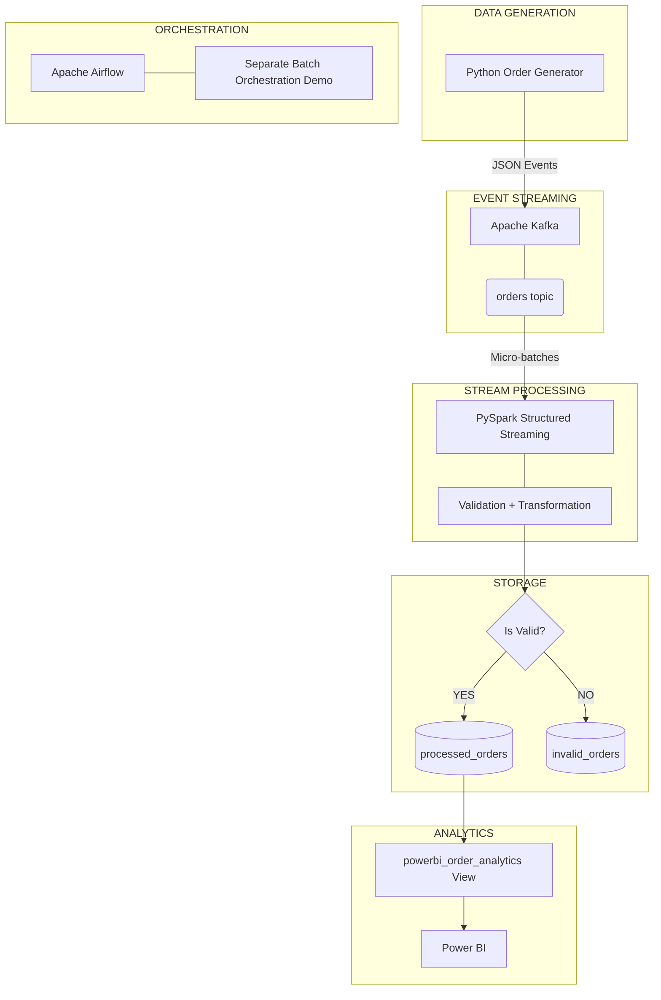
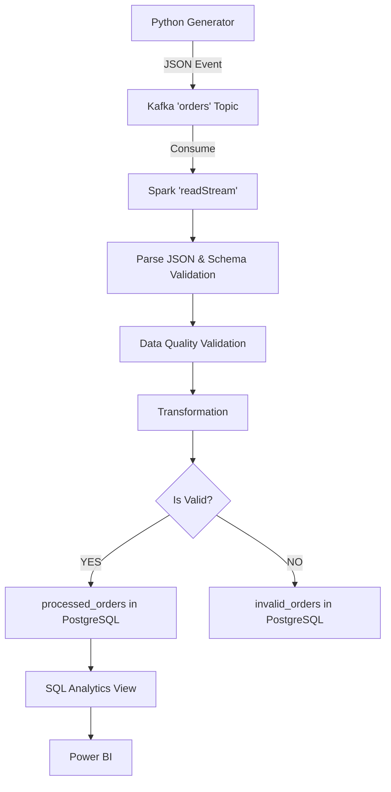
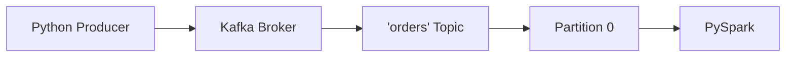
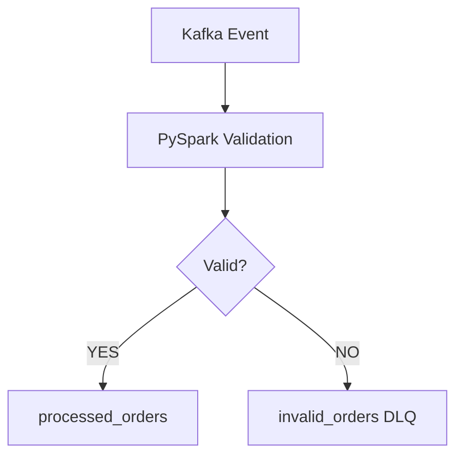
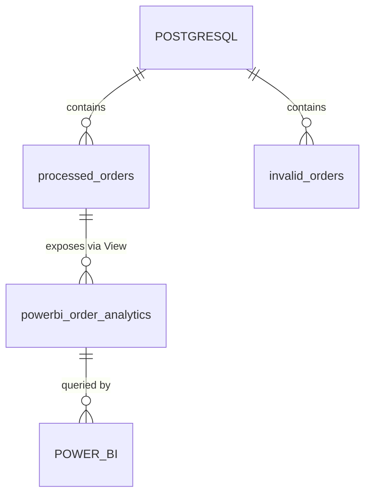

# StreamFlow

StreamFlow is a local real-time e-commerce data engineering pipeline that simulates order events, streams them through Apache Kafka, processes and validates them using PySpark Structured Streaming, stores processed and invalid events in PostgreSQL, and exposes the processed data through a SQL analytics view for downstream BI tools such as Power BI.

     

## Table of Contents
- [Overview](#overview)
- [Problem Statement](#problem-statement)
- [Architecture](#architecture)
- [End-to-End Data Flow](#end-to-end-data-flow)
- [Data Source](#data-source)
- [Kafka Ingestion](#kafka-ingestion)
- [PySpark Processing](#pyspark-processing)
- [Data Validation & DLQ](#data-validation--dlq)
- [PostgreSQL Storage](#postgresql-storage)
- [Data Retrieval & Analytics](#data-retrieval--analytics)
- [Power BI](#power-bi)
- [Airflow](#airflow)
- [Docker Infrastructure](#docker-infrastructure)
- [Project Structure](#project-structure)
- [Technology Stack](#technology-stack)
- [How to Run](#how-to-run)
- [Testing](#testing)
- [Example Data Flow](#example-what-happens-to-an-order)
- [Design Decisions](#design-decisions)
- [Limitations](#limitations)
- [Interview Talking Points](#interview-talking-points)

---

## Overview
StreamFlow focuses on demonstrating Data Engineering concepts rather than building a production e-commerce platform. It is a strictly scoped portfolio project designed to run locally, providing reproducible architecture and clean code.

## Problem Statement
A fictional e-commerce platform continuously generates customer order events. StreamFlow demonstrates how a modern Data Engineering pipeline can:
- Ingest high-throughput events
- Buffer and transport events reliably
- Process streaming data on the fly
- Validate data quality (catching bad events without crashing)
- Transform and enrich records
- Separate valid and invalid events (Dead-Letter Queue)
- Persist the results durably
- Expose the processed data for analytical consumption

## Architecture




*Note: Airflow orchestrates a separate daily batch demonstration. It does NOT control the continuous Kafka → Spark streaming pipeline.*

## End-to-End Data Flow



- **Generation:** Python script generates synthetic JSON.
- **Ingestion:** Kafka acts as the event broker holding the JSON string.
- **Consumption:** PySpark Structured Streaming continuously pulls micro-batches.
- **Parsing:** PySpark parses the JSON using an explicit schema.
- **Validation:** Events with negative quantities or missing timestamps branch off.
- **Transformation:** Timestamps are converted, `total_amount` is calculated, and date/hour features are derived.
- **Storage:** PySpark uses JDBC to write to `processed_orders` or `invalid_orders`.
- **Analytics:** Data is exposed via `powerbi_order_analytics` for BI dashboards.

## Data Source
The project does not consume real company or production data. The source is synthetic e-commerce order data generated by Python. 
Synthetic data is used for reproducible testing, controlled valid/invalid scenarios, and protecting sensitive customer information while demonstrating streaming concepts.

**Generator:** `streaming/kafka_producer.py`

**Example JSON Payload:**
```json
{
  "order_id": 1001,
  "customer_id": 501,
  "product": "Laptop",
  "category": "Electronics",
  "quantity": 2,
  "unit_price": 45000.0,
  "city": "Coimbatore",
  "timestamp": "2026-10-07T10:30:00"
}
```

## Kafka Ingestion
Apache Kafka acts as the event and message broker. The Python producer and the Spark processing engine are entirely decoupled. 



The producer does not directly write into PostgreSQL. Instead, it publishes to Kafka, which safely persists the events. This allows the streaming processor to consume events independently and at its own pace (handling backpressure).
- **Topic:** `orders`
- **Broker:** Local Docker setup using Kafka in KRaft mode.
- **Topology:** 1 partition, replication factor 1 (Local setup).

## PySpark Processing
**Script:** `streaming/spark_streaming.py`

PySpark handles the core ETL logic using the PySpark DataFrame API / Structured Streaming transformations:
1. **Reads Kafka:** Subscribes to the `orders` topic.
2. **Parses JSON:** Extracts the raw Kafka value against a predefined struct schema.
3. **Validates & Transforms:** Converts timestamps, calculates `total_amount` (`quantity * unit_price`), and extracts date and hour features.
4. **Validates Quality:** Evaluates constraints (e.g. quantity > 0).
5. **Micro-batching:** Uses `foreachBatch` to process data incrementally.
6. **JDBC Writes:** Appends data to PostgreSQL.
7. **Checkpointing:** Maintains consumer progress in `data/checkpoints/` to recover gracefully from restarts.

## Data Validation & DLQ
StreamFlow implements a Dead-Letter Queue (DLQ) pattern. Rather than silently discarding bad data, PySpark routes it to an error table (`invalid_orders`).



**Validation Rules:**
- `order_id` is not null
- `order_timestamp` is not null
- `quantity` > 0
- `unit_price` > 0

Invalid records are retained for data quality investigation, debugging, and auditability.

## PostgreSQL Storage
PostgreSQL serves as the persistent storage layer. 

### `processed_orders`
Contains valid, transformed order records.
- `order_id`
- `customer_id`
- `product`
- `category`
- `quantity`
- `unit_price`
- `total_amount`
- `city`
- `order_timestamp`
- `order_date`
- `order_hour`

*Note: `processed_orders` is intentionally append-only and does not use `order_id` as a primary key. Duplicate streaming events could otherwise cause a primary-key violation and repeatedly fail the micro-batch. Downstream deduplication can be applied when required.*

### `invalid_orders`
Contains bad events that failed validation.
- `order_id`
- `raw_data`
- `error_reason`
- `processed_at`



## Data Retrieval & Analytics
Data can be directly retrieved via standard SQL queries against PostgreSQL.

```sql
-- Retrieve recent processed orders
SELECT * FROM processed_orders 
ORDER BY order_timestamp DESC LIMIT 10;

-- Simple aggregation
SELECT category, SUM(total_amount) AS revenue 
FROM processed_orders 
GROUP BY category ORDER BY revenue DESC;
```

A specific SQL VIEW, `powerbi_order_analytics`, is created strictly for analytical consumption. It provides a clean query layer that doesn't duplicate the underlying table data.

## Power BI
Power BI is the downstream analytics target. The PostgreSQL analytics view and dashboard specification are implemented/documented; a committed `.pbix` file is not included.

The specified dashboard visualizes:
- Total Orders, Total Revenue, Average Order Value
- Revenue by Category & Revenue Trend
- Top Products and Orders by Hour
- Data Quality %

## Airflow
Airflow does not orchestrate the continuous Kafka → PySpark Structured Streaming pipeline in this project. 

The pipeline runs continuously, whereas Airflow is better suited to scheduled batch workflows. Included in the repository is a separate educational batch-orchestration demonstration (`daily_pipeline.py`) to demonstrate an understanding of the distinction between batch orchestration and continuous streaming.

## Docker Infrastructure
Docker provides reproducible local infrastructure.
- **Kafka** runs locally in a container.
- **PostgreSQL** runs locally in a container.
- **Python/PySpark** run from the local virtual environment natively.

## Project Structure
```text
streamflow/
├── producer/               # Python synthetic data generation logic
├── streaming/              # Kafka producer and PySpark streaming application
├── database/               # PostgreSQL schema and initialization
├── airflow/                # Batch orchestration demonstration
│   └── dags/               # Airflow DAGs
├── dashboard/              # Power BI integration specifications
├── data/                   
│   └── checkpoints/        # Spark checkpoint state (Ignored by Git)
├── tests/                  # Pytest unit testing suite
├── docs/                   # Additional project documentation
├── README.md               
├── requirements.txt        # Python dependencies
├── docker-compose.yml      # Kafka and PostgreSQL infrastructure
├── .env.example            # Example environment variables
└── .gitignore              
```

## Technology Stack
| Layer | Technology | Purpose |
|---|---|---|
| Data Generation | Python | Synthetic order events |
| Event Streaming | Apache Kafka | Event broker |
| Stream Processing | PySpark Structured Streaming | Parsing, validation, transformation |
| Storage | PostgreSQL | Processed/invalid event storage |
| Analytics | Power BI | Downstream visualization target |
| Orchestration Demo | Apache Airflow | Batch orchestration demonstration |
| Infrastructure | Docker Compose | Local Kafka/PostgreSQL infrastructure |

## How to Run

### 1. Clone
```bash
git clone https://github.com/yourusername/StreamFlow.git
cd StreamFlow
```

### 2. Environment
```bash
python3.12 -m venv .venv
source .venv/bin/activate
pip install -r requirements.txt
```

### 3. Environment Variables
```bash
cp .env.example .env
```
*(Do not commit passwords. The `.env` file safely points the Python scripts to the local database credentials).*

### 4. Start Infrastructure
```bash
docker compose up -d
```

### 5. Verify Services
```bash
docker compose ps
```

### 6. Verify Kafka Topic
```bash
docker exec streamflow-kafka /opt/kafka/bin/kafka-topics.sh \
  --bootstrap-server localhost:9092 --list
```

### 7. Start Spark
```bash
.venv/bin/python streaming/spark_streaming.py
```

### 8. Generate Orders (New Terminal)
```bash
source .venv/bin/activate
.venv/bin/python streaming/kafka_producer.py
```

### 9. Query PostgreSQL
```bash
docker exec -it streamflow-postgres psql -U postgres -d streamflow
```
```sql
SELECT COUNT(*) FROM processed_orders;
```

## Testing
- **Unit Tests:** Run `pytest -v` to execute generation tests (`1 passed`).
- **End-to-End Verification:** Verified by producing 5 records and confirming PostgreSQL counts increased exactly by 5 valid records.
- **DLQ Validation:** Sending intentional bad data resulted in 5 exact hits to `invalid_orders` via the PySpark branching logic.
- **Checkpoint Resilience:** `.metadata`, `commits`, `offsets`, and `sources` are successfully generated and preserved in `data/checkpoints/`.

## Example: What Happens to an Order?
1. **Python generates order `1001`** (Laptop, Qty: 2, Price: 45000).
2. Event is serialized as JSON and **published to Kafka topic `orders`**.
3. **PySpark Structured Streaming consumes it** in the next micro-batch.
4. PySpark **parses the JSON** against the `StructType` schema.
5. PySpark **validates** quantity (>0) and timestamp.
6. PySpark **calculates `total_amount`** (2 * 45000 = 90000).
7. PySpark identifies it as a valid event and uses `foreachBatch` to JDBC-write it to **`processed_orders`**.
8. **PostgreSQL stores the record.**
9. The `powerbi_order_analytics` SQL view exposes the data, allowing a connected **Power BI dashboard to visualize the sale.**

*(If the quantity was `-1`, PySpark would route the event to `invalid_orders` with the reason "Data Quality Check Failed" without crashing the stream).*

## Design Decisions
| Decision | Reason |
|---|---|
| Kafka | Decouple event production and processing |
| PySpark Structured Streaming | Streaming transformation and validation |
| foreachBatch | Write valid and invalid records to separate PostgreSQL destinations |
| PostgreSQL | Simple relational analytical storage |
| Append-only processed_orders | Avoid streaming failures from duplicate order IDs |
| Checkpointing | Persist streaming progress for recovery |
| Airflow separately | Demonstrate batch orchestration without controlling continuous streaming |
| Synthetic data | Reproducible portfolio testing without sensitive data |
| Docker | Reproducible local infrastructure |

## Limitations
- **Single Broker:** Local setup utilizes a single Kafka broker with 1 partition and replication factor 1.
- **Local Storage:** Single-node PostgreSQL instance without enterprise sharding.
- **Append-Only Structure:** Due to streaming duplicate possibilities, deduplication is intentionally pushed downstream instead of maintaining a database primary key.
- **No Cloud Integration:** The pipeline does not run on AWS/GCP, Databricks, or Confluent Cloud.
- **No Production Monitoring:** No Datadog, Prometheus, or Grafana integrations for observability.
- **Power BI Artifact:** While the analytics view is deployed, a local `.pbix` file is not included in the repository.

## Interview Talking Points
This project demonstrates functional knowledge of:
- **Why Kafka?** Decoupling ingestion from analytical processing logic.
- **Kafka Internals:** Brokers, Topics, Partitions, and Offsets.
- **PySpark Structured Streaming:** Converting continuous streams into micro-batches for efficient clustered processing.
- **foreachBatch:** Branching streaming execution paths into multiple persistence targets.
- **Checkpointing:** State recovery mechanisms ensuring offsets aren't lost upon restart.
- **Dead-Letter Queues (DLQ):** Handling malformed payloads gracefully without crashing the ETL application.
- **Append-Only Relational Modeling:** Understanding the tradeoff of database constraints versus streaming resilience.
- **Orchestration Paradigms:** Recognizing why Airflow schedules batch tasks but does not invoke persistent streaming apps.
